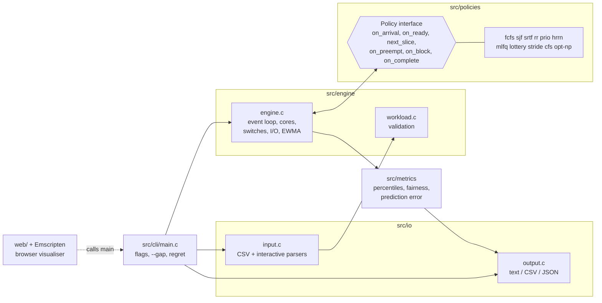

# CPU Scheduling Simulator

A verified, event-driven CPU scheduling lab in C11: 12 policies from FCFS to a CFS model and an exact optimum, multi-core, context switches, I/O and burst prediction, with an interactive WebAssembly visualiser.

[](https://github.com/sneharc16/Preemptive-and-Non-Preemptive-CPU-Scheduling-Simulator/actions/workflows/ci.yml)
[](https://codecov.io/gh/sneharc16/Preemptive-and-Non-Preemptive-CPU-Scheduling-Simulator)
[](LICENSE)
[](https://sneharc16.github.io/Preemptive-and-Non-Preemptive-CPU-Scheduling-Simulator/)

**[Try it in the browser →](https://sneharc16.github.io/Preemptive-and-Non-Preemptive-CPU-Scheduling-Simulator/)** (the same C engine, compiled to WebAssembly)

[](https://sneharc16.github.io/Preemptive-and-Non-Preemptive-CPU-Scheduling-Simulator/?preset=convoy)

## Quick start

```bash
git clone https://github.com/sneharc16/Preemptive-and-Non-Preemptive-CPU-Scheduling-Simulator.git && cd Preemptive-and-Non-Preemptive-CPU-Scheduling-Simulator
make
./sched --input=examples/mixed.csv --algo=all,opt-np --gap --metrics=full
```

Other useful commands: `make test` (all tests), `make asan` (all tests under ASan + UBSan), `make experiments` (regenerates every plot and number in [docs/results](docs/results/README.md)), `./sched --help`.

## Features

| Policy (`--algo`) | Preemptive | Cost per decision | Starvation-free | Needs burst lengths |
|---|---|---|---|---|
| `fcfs` First Come First Served | no | O(1) | yes | no |
| `sjf` Shortest Job First | no | O(log n) | no | yes (or `--predict=ewma`) |
| `srtf` Shortest Remaining Time First | yes | O(log n) | no | yes (or `--predict=ewma`) |
| `rr` Round Robin | yes | O(1) | yes | no |
| `prio` / `prio-p` Priority | no / yes | O(log n) expected | only with `--aging` | no |
| `hrrn` Highest Response Ratio Next | no | O(distinct burst lengths among ready) | yes | yes (or `--predict=ewma`) |
| `mlfq` Multi-Level Feedback Queue (OSTEP rules) | yes | O(levels) | only with `--mlfq-boost` | no |
| `lottery` Lottery | yes | O(log n) | with probability 1 | no |
| `stride` Stride | yes | O(log n) | yes | no |
| `cfs` CFS-lite (simplified Linux CFS model) | yes | O(log n) | yes | no |
| `opt-np` exact non-preemptive optimum | no | branch and bound, n ≤ 20 | n/a (offline) | yes (offline) |

Machine model options (all off by default): `--cores=N` (one shared ready queue), `--cs-cost=C` (context-switch ticks), I/O phases via a `bursts` column (`cpu:io:cpu`), and `--predict=ewma --alpha --tau0` (burst prediction, with MAE/MAPE and regret against exact knowledge). Output is text, CSV or JSON ([schema](docs/json-schema.md)) with mean/median/p95/p99/max turnaround, waiting and response, slowdown, Jain's fairness index, throughput, utilisation and switch overhead. The precise model is in [docs/model.md](docs/model.md).

## Architecture



The engine owns time, cores, the timeline and all accounting; a policy only answers "who runs next, and for how long?". Adding a policy is one file plus one line in `src/policies/registry.c`. Details: [docs/DESIGN.md](docs/DESIGN.md).

## How correctness is verified

- **Golden tests.** The original single-file program's output was captured before the rewrite (52 workloads × 4 quanta); the rewritten simulator reproduces its CSV byte for byte.
- **Differential testing.** [`tools/reference_sim.py`](tools/reference_sim.py) is a deliberately naive tick-by-tick simulator that shares no code with the engine and re-decides every tick instead of reacting to events. On every test run, 5,000 random workloads, each with random cores, switch cost, I/O phases, prediction and policy parameters, must give identical per-core Gantt charts for all 11 online policies. This found two real engine bugs (a switch-in livelock and a multi-core re-decision gap), now fixed with regression tests.
- **Properties on every schedule.** No gaps or overlaps; each process runs exactly its bursts, never during its I/O and never on two cores at once; no core idles while work is ready; every summary statistic is recomputed independently ([tests/properties.py](tests/properties.py)).
- **Theorems as tests.** SJF equals the brute-force optimum when everyone arrives at once; SRTF equals an exhaustive search over all preemptive schedules; `opt-np` equals brute force over all job orders and is never beaten by a non-preemptive policy.
- **Hand-computed cases** for every policy, context switches, I/O, multi-core and prediction.
- **Sanitizers, fuzzing, coverage.** The whole suite runs under ASan + UBSan; a libFuzzer harness fuzzes the parsers and engine in CI; line coverage of `src/` is enforced at 90% or more; the WebAssembly build must print exactly what the native binary prints.

## Key results

Every number here comes from [docs/results](docs/results/README.md), which `make experiments` regenerates (benchmarks on an Apple M1).

**Scale.** At n = 1,000,000 processes every policy simulates in at most 1.67 s with at most 307 MB peak memory, and fitted log-log slopes lie between 1.01 and 1.06. Profiling showed priority scheduling and HRRN were quadratic under overload; replacing their scans with a treap and burst-length groups took prio-p with aging from 40.67 s to 0.21 s on 40,000 processes ([before/after](docs/results/perf/before_after.md)).


**Size-based policies win on turnaround, MLFQ on response.** SRTF has the lowest mean turnaround for every burst distribution tested and MLFQ the lowest mean response; on Pareto bursts FCFS's mean turnaround is 8.2x the best.


**The Round Robin quantum trade-off.** With a switch cost of 2 ticks, mean turnaround is 3937 at q=1, 951 at q=12 and 1127 at q=128.


**Greedy is not optimal.** Over 1,000 random instances, non-preemptive SJF matches the exact optimum on 70.1% of them (worst gap 64.6%), HRRN on 18.9% and FCFS on 12.7%.


More in [docs/results](docs/results/README.md): the convoy effect, heavy-tailed workloads, EWMA prediction and starvation vs aging.

## Design decisions and trade-offs

- **Event-driven engine, tick-level reference.** The engine jumps between events (O(events × log n)); the reference steps every tick and is slow but obviously correct. Agreement between two very different implementations is the main correctness argument.
- **Policies decide, the engine accounts.** Policies see a read-only view and return `(process, length, deadline)`; they never touch time or metrics, so one engine serves every policy and machine option.
- **Exact arithmetic.** All time is `int64_t` with validated bounds; HRRN compares ratios as exact fractions; CFS uses fixed-point vruntime; floating point appears only in EWMA and is built with `-ffp-contract=off`, so results match across compilers and the Python reference.
- **Deterministic by construction.** Every tie is broken by (arrival, pid) and lottery uses its own seeded SplitMix64 generator, so every run on every platform is reproducible.
- **Semantics made explicit.** Cases textbooks leave open (an arrival coinciding with a preemption, what can interrupt a switch-in, how MLFQ treats an interrupted job) are written down in [docs/model.md](docs/model.md) and pinned by tests.
- **Backward compatible.** The original command-line behaviour and output are preserved at default options; new output only appears with new flags.

## Limitations

- Integer ticks; no sub-tick events.
- Multi-core uses one global ready queue: no per-core run queues, load balancing, cache affinity or migration cost beyond the ordinary switch cost.
- The I/O device has unlimited capacity (no I/O queueing).
- CFS-lite omits wakeup preemption, period stretching, START_DEBIT and group scheduling; it models CFS's idea, not its code.
- `opt-np` is exact but exponential in the worst case: at most 20 processes, one core, no I/O or switch cost.
- Workloads are synthetic (`tools/gen.py`); there is no trace replay yet.

## References

- R. H. Arpaci-Dusseau and A. C. Arpaci-Dusseau, *Operating Systems: Three Easy Pieces*, chapters 7-9 (scheduling, MLFQ, proportional share). https://pages.cs.wisc.edu/~remzi/OSTEP/
- A. Silberschatz, P. B. Galvin and G. Gagne, *Operating System Concepts*, chapter 5 (CPU scheduling).
- Linux kernel documentation, "CFS Scheduler". https://docs.kernel.org/scheduler/sched-design-CFS.html
- C. A. Waldspurger and W. E. Weihl, "Lottery Scheduling: Flexible Proportional-Share Resource Management", OSDI 1994.
- C. A. Waldspurger, "Lottery and Stride Scheduling: Flexible Proportional-Share Resource Management", PhD thesis, MIT, 1995.
- L. Schrage, "A Proof of the Optimality of the Shortest Remaining Processing Time Discipline", Operations Research 16(3), 1968.
- J. K. Lenstra, A. H. G. Rinnooy Kan and P. Brucker, "Complexity of Machine Scheduling Problems", Annals of Discrete Mathematics 1, 1977 (1|r_j|ΣC_j is strongly NP-hard).

## Contributing and licence

See [CONTRIBUTING.md](CONTRIBUTING.md) and [CHANGELOG.md](CHANGELOG.md). Released under the [MIT License](LICENSE).
