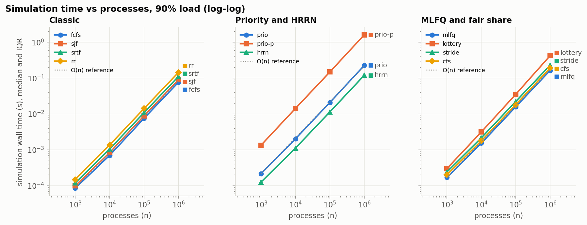
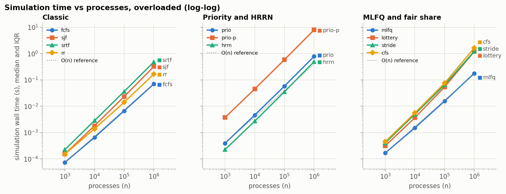
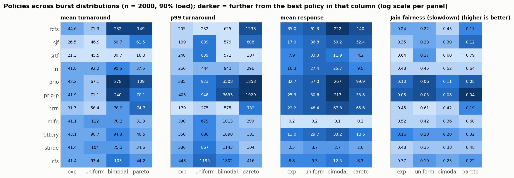
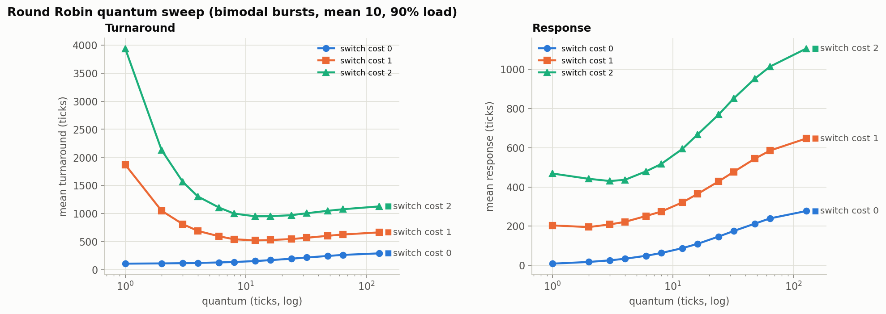
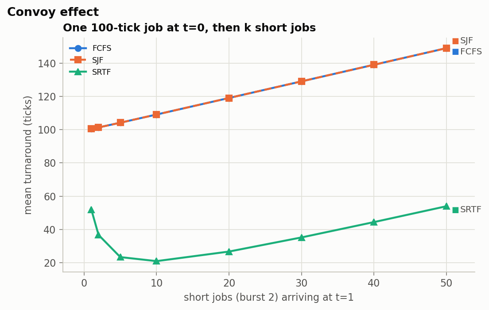
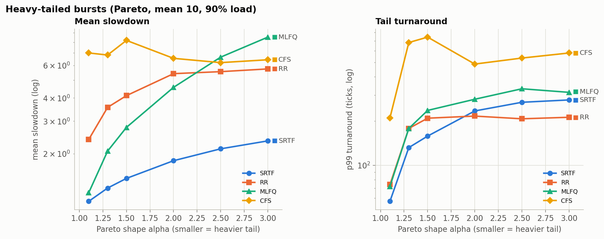
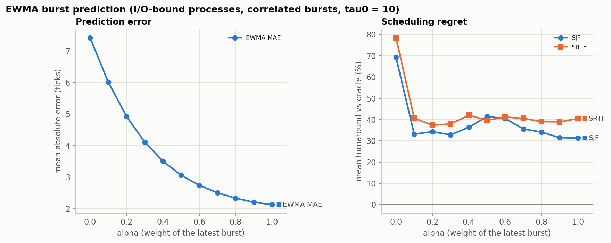
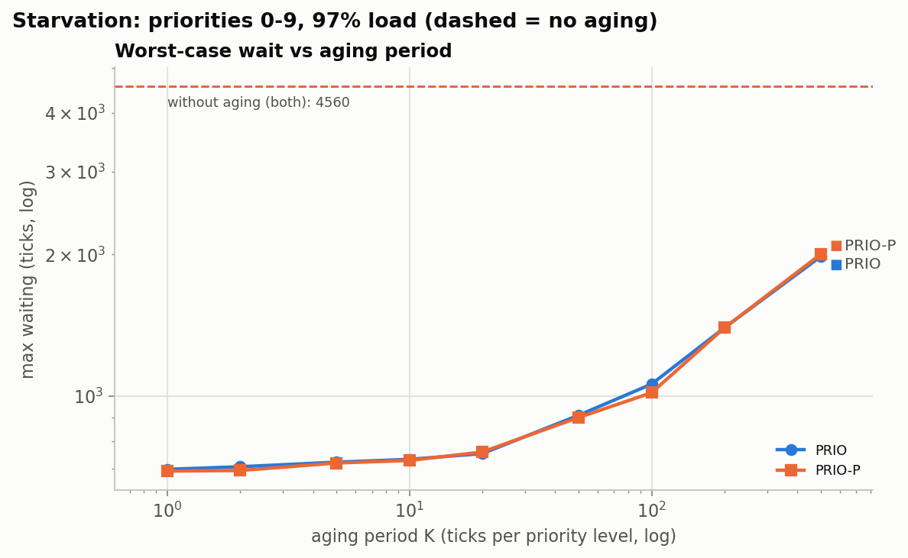
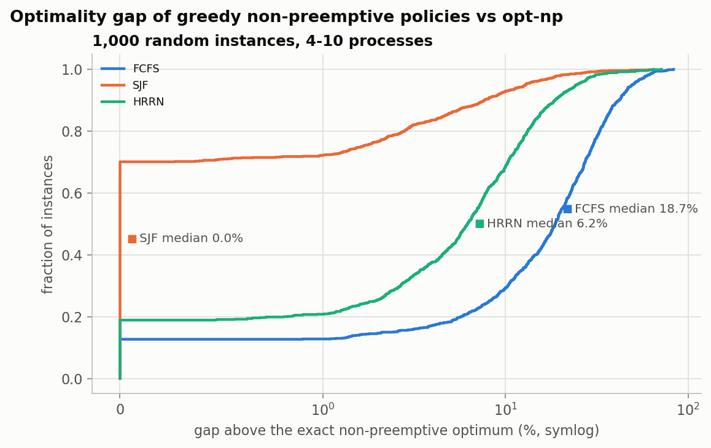

# Results

Everything here is generated by `make experiments` (which runs
`experiments/run_all.py`); do not edit by hand. Each plot has its data next to it as a
CSV file, and every number in the takeaways is computed from that data.

Generated from commit `dc1652d`. Benchmarks ran on: Apple M1, 8 cores, Darwin 25.6.0.

## Performance

### Simulation time vs processes (90% load)

**Takeaway:** At n = 1,000,000 every policy simulates in at most 1.61 s (slowest: prio-p) with at most 307 MB peak memory; fitted log-log slopes from n = 10^4 lie between 1.01 and 1.06 (1.0 = linear).

Data: [bench.csv](bench.csv), fitted slopes: [bench_exponents.csv](bench_exponents.csv)

### Simulation time vs processes (overloaded)

**Takeaway:** With the ready queue growing to about n/2, the largest fitted slope is 1.26 (lottery): no policy is quadratic.

Data: [bench_overload.csv](bench_overload.csv), fitted slopes: [bench_exponents.csv](bench_exponents.csv)

Profiling notes: [perf/profile_prio_p.md](perf/profile_prio_p.md).

## Experiments

### Policy comparison across burst distributions

**Takeaway:** Lowest mean turnaround in every distribution: srtf; lowest mean response: mlfq (exp), mlfq (uniform), mlfq (bimodal), mlfq (pareto); on Pareto bursts FCFS's mean turnaround is 8.2x the best.

Data: [exp1_policy_comparison.csv](exp1_policy_comparison.csv)

### Round Robin quantum sweep, with and without switch cost

**Takeaway:** With switch cost 2, mean turnaround is 3937 at q=1, 951 at q=12 and 1127 at q=128 (a U shape); with free switches the best quantum is 1. Mean response grows from 8.5 (q=1) to 277.1 (q=128).

Data: [exp2_rr_quantum.csv](exp2_rr_quantum.csv)

### Convoy effect

**Takeaway:** With 50 short jobs queued behind a 100-tick job, mean turnaround is 149.0 under FCFS and 149.0 under SJF (no better: it cannot preempt the job already running) but 53.9 under SRTF.

Data: [exp3_convoy.csv](exp3_convoy.csv)

### Heavy-tailed workloads

**Takeaway:** At alpha = 1.1 mean slowdown is 1.11 for SRTF, 1.24 for MLFQ, 2.39 for RR and 7.00 for CFS-lite; MLFQ, which needs no burst knowledge, ranks #2 of 4.

Data: [exp4_heavy_tail.csv](exp4_heavy_tail.csv)

### EWMA alpha sweep: prediction error vs scheduling regret

**Takeaway:** MAE falls from 7.42 (alpha 0: never learns) to 2.12 at alpha 1.0; SRTF's regret against exact bursts goes from 78.5% to 40.5% and SJF's from 69.2% to 31.3%.

Data: [exp5_ewma.csv](exp5_ewma.csv)

### Starvation and aging

**Takeaway:** Without aging the longest wait is 4560 ticks (prio) and 4560 (prio-p); aging every 5 ticks cuts it to 723 and 720.

Data: [exp6_starvation.csv](exp6_starvation.csv)

### Optimality gap of greedy non-preemptive policies

**Takeaway:** SJF is exactly optimal on 70.1% of instances (median gap 0.00%, worst 64.6%); HRRN on 18.9% (worst 71.4%); FCFS on 12.7% (worst 83.3%).

Data: [exp7_optimality_gap.csv](exp7_optimality_gap.csv)
